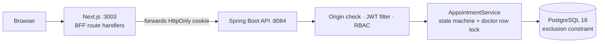

# Clinic Appointment System

Appointment booking for a clinic: patients book, doctors confirm and complete, admins manage. Spring Boot REST API on PostgreSQL with a Next.js frontend, role-based dashboards, and database-enforced protection against double-booking a doctor.

## Architecture



The browser only talks to the Next.js server, which proxies to the API. The JWT lives in an `HttpOnly`, `SameSite=Strict` cookie and never touches JavaScript, so there is no CORS setup and no token in `localStorage`.

The backend is a deliberate monolith: one domain, one team, no need for distributed transactions or service discovery. Extract services only when independent scaling or more than a handful of bounded contexts justify it.

| Layer | Technology |
|-------|-----------|
| Backend | Java 21, Spring Boot 3.5, Spring Security, JPA, Flyway |
| Database | PostgreSQL 16 (`btree_gist` exclusion constraint) |
| Frontend | Next.js 15 (App Router), TypeScript, Tailwind CSS, TanStack Query/Table, React Hook Form + Zod |
| Docs | Springdoc OpenAPI / Swagger UI |
| Tests | JUnit 5, Mockito, Testcontainers (PostgreSQL) |
| CI | GitHub Actions |

## Run it locally

Requirements: Docker + Docker Compose.

```bash
docker compose up --build
```

| What | URL |
|------|-----|
| Frontend | http://localhost:3003 |
| API | http://localhost:8084 |
| Swagger UI | http://localhost:8084/swagger-ui/index.html |

### Your data survives restarts

Database data lives in a named Docker volume. `docker compose up -d` after a reboot or after `docker compose stop` / `down` brings everything back with all records intact; containers also restart automatically (`restart: unless-stopped`). The only command that deletes the data is `docker compose down -v` (or `docker volume rm`), so do not use `-v` unless you want a clean slate.

Demo accounts (seeded by Flyway):

| Username | Password | Role |
|----------|----------|------|
| `admin` | `admin123` | ROLE_ADMIN |
| `dr.weber` | `doctor123` | ROLE_DOCTOR |
| `mueller` | `patient123` | ROLE_PATIENT |

Compose sets `APP_COOKIE_SECURE=false` because the demo runs on plain HTTP. The application default is `Secure=true`. Set `JWT_SECRET` (at least 32 characters) in your environment or `.env` for anything other than a local demo.

### Configuration

| Variable | Default | Description |
|----------|---------|-------------|
| `SPRING_DATASOURCE_URL` | `jdbc:postgresql://localhost:5437/clinic_db` | PostgreSQL URL |
| `PGUSER` / `PGPASSWORD` | `postgres` / `postgres123` | DB credentials (local demo values) |
| `JWT_SECRET` | none in production | min 32 characters |
| `app.cookie.secure` | `true` | `Secure` flag of the auth cookie |
| `app.cookie.same-site` | `Strict` | `SameSite` of the auth cookie |
| `app.cors.allowed-origins` | `http://localhost:3000,3001,3003` | Origins accepted by the Origin check and CORS |

## Double-booking protection

Two requests for the same doctor and time must not both succeed, even when they arrive in the same millisecond. Three layers:

1. **Row lock**: the service loads the doctor with `SELECT ... FOR UPDATE` before checking for conflicts, so concurrent bookings for one doctor are serialized.
2. **Conflict check** against existing active appointments (a 30-minute slot, half-open, so 10:00 and 10:30 do not collide) and suggestion of alternative free slots in the `409` response.
3. **Database constraint** (migration V12) as the final guarantee, independent of application code:

```sql
EXCLUDE USING gist (
  doctor_id WITH =,
  tsrange(appointment_time, appointment_time + INTERVAL '30 minutes') WITH &&
) WHERE (doctor_id IS NOT NULL AND status NOT IN ('CANCELLED', 'NO_SHOW'))
```

Cancelled and no-show appointments free the slot. Lock waits are bounded (`lock_timeout`), and lock or constraint failures return `409`, not `500`.

A Testcontainers test fires 12 simultaneous bookings at one slot and expects exactly one success. The same race was reproduced directly on PostgreSQL 16 with raw inserts: 1 accepted, 11 rejected by the constraint.

## State machine

```
PENDING ──> CONFIRMED ──> COMPLETED
   │            │
   └─> CANCELLED └─> CANCELLED / NO_SHOW
```

Only ADMIN and DOCTOR can change status. Every response carries `allowedTransitions`, which the UI uses to enable buttons, and illegal transitions return `409` as RFC 7807 ProblemDetail.

## Roles

| Endpoint | PATIENT | DOCTOR | ADMIN |
|----------|---------|--------|-------|
| `GET /api/appointments`, `/search`, `/{id}` | yes | yes | yes |
| `POST /api/appointments` | yes | yes | yes |
| `PUT /api/appointments/{id}` | yes | yes | yes |
| `PATCH /api/appointments/{id}/status` | no | yes | yes |
| `DELETE /api/appointments/{id}` | no | no | yes |

## Security model

- Passwords are stored as BCrypt hashes.
- **Auth cookie**: `HttpOnly`, `Secure` (default), `SameSite=Strict`.
- **CSRF**: because the browser sends the cookie automatically, "stateless JWT" is not a reason to skip CSRF protection. The API checks `Origin` (then `Referer`) on state-changing requests against `app.cors.allowed-origins`, in addition to `SameSite=Strict` and JSON-only bodies. Requests with neither header (non-browser clients) are allowed, since CSRF is a browser attack.
- Roles are enforced in the API on every request; UI hiding is only UX. Anonymous calls get `401`, a valid token with too weak a role gets `403`.
- **Object-level access**: a role check alone would let any patient read or change other patients' appointments. `AppointmentAccessPolicy` limits ADMIN to everything, DOCTOR to their own schedule and PATIENT to their own bookings (list, search, read, update, status). A foreign id answers `404`, and a patient's booking always carries the patient's own login, whatever the request body says. `ApiAuthorizationTest` covers no token, forged token, wrong role and other people's data.

### GDPR note

Appointment data is health data (Art. 9 GDPR). Implemented: hashed passwords, cookie not readable by scripts, secrets kept out of version control. Not implemented: audit logging, retention policy, erasure endpoint; these are required before real patient data.

## API overview

```
POST   /api/auth/login | /api/auth/logout
GET    /api/appointments
GET    /api/appointments/search?status=PENDING&doctorName=weber&page=0&size=10
GET    /api/appointments/{id}
POST   /api/appointments        (body may carry doctorId or doctorName)
PUT    /api/appointments/{id}
PATCH  /api/appointments/{id}/status
DELETE /api/appointments/{id}
```

## Frontend

Role routing (`/admin`, `/doctor`, `/patient`), skeleton loading, `409` conflict handling with alternative slots, Ctrl+K command palette, English/German/Turkish, dark/light theme, keyboard-accessible controls.

```bash
cd frontend/clinic-app
npm ci && npm run dev    # http://localhost:3000, needs the API on :8084
```

## Tests

```bash
./mvnw verify
```

Unit tests (Mockito) cover the service and state machine. Integration tests run on a real PostgreSQL via Testcontainers (no H2) and need Docker; they are skipped automatically without it.

## Known limitations

- Seed users and appointments live in the regular Flyway migrations. A production deployment would move them to a separate demo location, as done in the WMS project.
- Appointment slots are fixed at 30 minutes.
- The Java build and the compose stack require Maven Central and Docker Hub access.

## License

MIT
